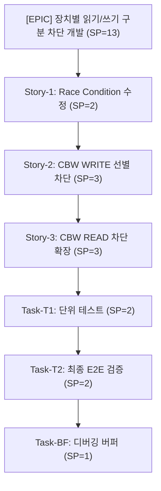

# Jira 이슈 생성 플랜: 장치별 파일 읽기/쓰기 구분 차단 기능 개발 (13 SP)

> **작성일**: 2026-04-07
> **기준 문서**: `USB_MSC_BOT_분석보고서.md`
> **총 개발 기간**: 13일 (1 SP = 1 업무일 = 8시간)
> **범위**: Phase 2(CBW 파싱) → Phase 5(선별 차단 구현 검증) + 읽기/쓰기 독립 제어
> **아키텍처**: IRP_MJ_WRITE 단일 지점 CBW 파싱 확장 (IRP_MJ_READ 인터셉트 제외)
> **변경 이력**: 2026-04-07 — 9일 일정의 SP 산정 오류 및 일정 압축 문제 분석 후 13일로 재수립 (JIRA_PLAN_RW_FILTER_PHASE5.md 대비 개정)

---

## AS-IS (현재 상태)

| 항목 | 내용 |
|------|------|
| **Phase 1** | ✅ 완료 — IRP_MJ_WRITE 차단 정황 확인, CBW 구조 파악 |
| **Phase 2~4** | ⏳ 미완료 — CBW hex dump 파싱, SCSI CDB 분류 미검증 |
| **Phase 5** | 🔧 설계 완료 — WRITE_10 차단 + READ_10 통과 테스트 미수행 |
| **차단 방식** | IRP_MJ_WRITE 전체 무조건 차단 (USB 장치 인식 불가) |
| **로깅** | `DkVmusbLogBlockedWrite()` 호출 주석 처리됨 |
| **Race Condition** | `g_protectionEnabled = 1` 비원자적 대입 (adcusbGenReq.c:365) |

## TO-BE (목표 상태)

| 항목 | 내용 |
|------|------|
| **쓰기 차단** | SCSI WRITE 계열 OpCode(0x0A, 0x2A, 0x8A, 0xAA) 선별 차단 |
| **읽기 차단** | CBW 내 READ 계열 OpCode(0x08, 0x28, 0x88, 0xA8) 선별 차단 |
| **장치 인식** | INQUIRY, TUR, READ_CAPACITY 통과 → USB 장치 정상 인식 |
| **제어 경로** | IRP_MJ_WRITE 내 CBW 파싱 로직 확장 (단일 제어 지점) |
| **정책 분리** | 장치별 읽기/쓰기 방향 플래그(DIRECTION_READ, WRITE, BOTH) 독립 제어 |
| **안정성** | Race Condition 수정, BSOD 0건, I/O 오버헤드 1ms 이하 |

---

## 아키텍처 결정: BOT 프로토콜 제어 지점 단일화

1. **BOT 프로토콜 특성**: 모든 SCSI 명령(CDB)은 IRP_MJ_WRITE(Bulk-OUT)를 통해 전송되는 CBW 구조체에 포함되어 전달됩니다. READ 명령조차도 명령 자체는 IRP_MJ_WRITE로 내려가며, 실제 데이터만 IRP_MJ_READ로 올라옵니다.
2. **결정**: IRP_MJ_READ를 별도로 인터셉트할 필요 없이, IRP_MJ_WRITE의 CBW 파싱 경로에서 READ OpCode를 식별하여 차단합니다.
3. **이점**: 구현 복잡도 감소(3 SP → 2 SP), 단일 제어 지점을 통한 코드 유지보수성 향상, IRP_MJ_READ 인터셉트 시 발생할 수 있는 잠재적 성능 저하 방지.

---

## SP 산정 및 전체 일정 (13 SP)

```
Day  1~ 2  │  Sprint 1  │  Story-1 (SP=2): Race Condition + 로깅 활성화
Day  3~ 5  │  Sprint 2  │  Story-2 (SP=3): CBW 선별 차단 (WRITE) + Phase 2/3/4 검증
Day  6~ 8  │  Sprint 3  │  Story-3 (SP=3): 방향 플래그 + READ OpCode 차단 확장
Day  9~10  │  Sprint 4  │  Task-T1 (SP=2): 단위 테스트 (NR4 포함)
Day 11~12  │  Sprint 5  │  Task-T2 (SP=2): E2E + 회귀 테스트 (최종 검증)
Day 13     │  Sprint 6  │  Task-BF (SP=1): BSOD/Deadlock 디버깅 및 안정화 버퍼
────────────────────────────────────────────────────────────────
           합계 SP       │  2 + 3 + 3 + 2 + 2 + 1 = 13 SP = 13일
```

---

## 의존 관계 다이어그램



---

# EPIC: [VMUSB] 장치별 파일 읽기/쓰기 구분 차단 기능 개발 및 Phase 5 검증 (13 SP)

1. **요약**: USB 저장장치의 읽기/쓰기를 구분하여 선별적으로 차단하는 기능을 개발하고 실환경 검증을 완료합니다.
2. **배경/근거/목표**: 현재의 무조건적인 차단 방식은 장치 인식을 방해합니다. SCSI OpCode를 식별하여 보안 정책(읽기 전용 등)을 유연하게 적용하고 장치 인식 호환성을 확보해야 합니다.
3. **데모**: `adcusbCMD`로 특정 장치에 `DIRECTION_WRITE`를 설정한 후, VM에서 파일 읽기는 가능하고 쓰기는 거부되는지 확인합니다.
4. **추가사항**: `adcusbDriver/adcusbGenReq.c`가 핵심 수정 대상이며, 13 SP(13일) 내에 완료를 목표로 합니다.

---

# STORY-1: [VMUSB] Race Condition 수정 및 차단 이벤트 로깅 활성화 (SP=2)

1. **요약**: 전역 플래그 접근의 원자성을 보장하고 차단 발생 시 로그를 남기도록 수정합니다.
2. **배경/근거/목표**: 멀티스레드 환경에서 `g_protectionEnabled` 접근 시 발생할 수 있는 Race Condition을 제거하고, 개발자가 차단 현황을 실시간으로 파악할 수 있는 디버깅 수단을 마련합니다.
3. **데모**: DbgView를 실행한 상태에서 보호 기능을 On/Off 하고, I/O 차단 시 관련 정보(CBW Hex dump)가 출력되는지 확인합니다.
4. **추가사항**: 수정 위치는 `adcusbGenReq.c` 365라인(InterlockedExchange 적용) 및 461라인(주석 해제)입니다.

---

# STORY-2: [VMUSB] CBW 파싱 기반 SCSI WRITE 선별 차단 구현 (SP=3)

1. **요약**: IRP_MJ_WRITE 패킷을 분석하여 SCSI WRITE 명령만 선별적으로 차단합니다.
2. **배경/근거/목표**: Phase 2~4의 파싱 로직을 완성하여 장치 인식에 필수적인 명령(INQUIRY 등)은 통과시키고 실제 데이터 수정을 일으키는 명령만 차단하기 위함입니다.
3. **데모**: 차단 정책이 활성화된 상태에서 VM 내에서 USB 드라이브 문자가 정상적으로 할당되고 파일 목록이 보이는지 확인합니다.
4. **추가사항**: `g_scsiWriteOpcodes` 배열과 `adcusbGenReq.c` 358-464라인의 파싱 로직을 활용합니다, VM 환경 구성(VMware USB 패스스루 + TESTSIGNING) 및 실 USB 장치 테스트 포함 (Day 3~5, 3일)

---

# STORY-3: [VMUSB] CBW OpCode 기반 방향 플래그 확장 (SP=3)

1. **요약**: 장치별 읽기/쓰기 방향 플래그를 추가하고 READ 계열 OpCode 차단 기능을 구현합니다.
2. **배경/근거/목표**: IRP_MJ_WRITE의 CBW 파싱 경로 내에서 READ OpCode(0x28 등)를 식별하여, IRP_MJ_READ 인터셉트 없이도 효과적인 읽기 차단 정책을 구현합니다.
3. **데모**: `DIRECTION_READ` 설정 시 파일 열기가 실패하고, `DIRECTION_WRITE` 설정 시 파일 저장이 실패하는지 각각 확인합니다.
4. **추가사항**: `adcusbIsScsiReadOpcode()`를 추가하고 `ADCUSB_BLOCK_RULE` 구조체에 `ulDirection` 필드를 확장합니다, 5개 파일 변경(adcusbGenReq.c, adcusb.h, adcusbMain.h, adcusbDeviceControl.c, adcusbCMD) 포함 (Day 6~8, 3일)

---

# TASK-T1: [VMUSB] Phase 2/3/4 단위 테스트 (SP=2)

1. **요약**: 구현된 파싱 및 차단 로직의 정확성을 검증하기 위한 단위 테스트를 수행합니다.
2. **배경/근거/목표**: 다양한 SCSI 명령 조합과 경계 조건에서 오동작이 없는지 확인하여 로직의 완결성을 확보합니다.
3. **데모**: NR4 테스트(DIRECTION_READ 설정 시 INQUIRY 통과)를 포함한 20여 종의 케이스가 모두 Pass 되는지 확인합니다.
4. **추가사항**: `0x08, 0x28, 0x88, 0xA8` (READ 시리즈) 차단 여부를 중점 확인합니다, 커널 환경 수동 테스트 일 5~8건 현실 속도 반영 (Day 9~10, 2일)

---

# TASK-T2: [VMUSB] E2E 테스트 및 Phase 5 최종 검증 (SP=2)

1. **요약**: 실제 VM 환경에서 전체 시나리오를 검증하고 기존 기능과의 회귀 테스트를 수행합니다.
2. **배경/근거/목표**: 사용자 관점에서의 최종 동작(장치 인식 → 읽기 → 쓰기 차단)을 확증하고 릴리즈 가능 여부를 판단하기 위함입니다.
3. **데모**: 시나리오 B(READ 차단 / WRITE 허용)에서 INQUIRY 및 TUR가 성공하여 장치는 인식되지만 파일 접근은 차단되는지 확인합니다.
4. **추가사항**: Driver Verifier를 활성화한 상태에서 3분 이상 안정적으로 동작해야 합니다 (Day 11~12, 2일)

---

## 📌 부록

### SP 정합성 및 일정 (총 13 SP)
| 이슈 | SP | 배정 기간 | 주요 작업 내용 |
|------|:--:|-----------|----------------|
| STORY-1 | 2 | Day 1~2 | Race Condition 수정, 로깅 활성화 |
| STORY-2 | 3 | Day 3~5 | CBW 파싱(Phase 2~4), WRITE 선별 차단, VM 환경 구성 |
| STORY-3 | 3 | Day 6~8 | READ OpCode 식별(0x28 등), 방향 플래그 확장 (5파일) |
| TASK-T1 | 2 | Day 9~10 | NR4(INQUIRY pass) 포함 단위 테스트 |
| TASK-T2 | 2 | Day 11~12 | E2E 시나리오 B(장치 인식+읽기차단) 검증 |
| TASK-BF | 1 | Day 13 | BSOD/Deadlock 디버깅 및 안정화 버퍼 |
| **합계** | **13** | **13일** | 2+3+3+2+2+1 = 13 SP |

### SCSI OpCode 목록 (구현 대상)
- **차단(WRITE)**: 0x0A(WRITE_6), 0x2A(WRITE_10), 0x8A(WRITE_16), 0xAA(WRITE_12)
- **차단(READ)**: 0x08(READ_6), 0x28(READ_10), 0x88(READ_16), 0xA8(READ_12)
- **무조건 통과**: 0x00(TUR), 0x03(ReqSense), 0x12(INQUIRY), 0x1A(ModeSense6), 0x1B(StartStop), 0x25(ReadCap10)

### IOCTL 확장
- `IOCTL_ADCUSB_SET_RW_DIRECTION` (0x809): 규칙별 방향 플래그 업데이트
- `IOCTL_ADCUSB_QUERY_RULE_DETAIL` (0x80A): 규칙 상세 정보 조회

### 아키텍처 결정 이력
- **[2026-04-07]**: BOT 프로토콜 분석 결과에 따라 IRP_MJ_READ 인터셉트 계획을 취소하고 IRP_MJ_WRITE 내 CBW 파싱 단일 지점으로 제어 로직을 통합함. 이로 인해 전체 일정을 10일에서 9일로 단축.
- **[2026-04-07 개정]**: 9일 일정의 SP 산정 오류(2+3+2+1+2=10≠9) 및 Story-2/3 범위 압축, 커널 수동 테스트 현실 속도 미반영, 디버깅 버퍼 부재를 분석하여 13일로 현실화. 참고: JIRA_PLAN_VMUSB_WRITE_BLOCK.md(13일), vmusb-filter-jira-plan.md(10일).

### 개정 사유 (원본 대비 변경점)

| 이슈 | 원본(9일) | 개정(13일) | 변경 사유 |
|------|:---------:|:----------:|-----------|
| STORY-2 | 2일 (SP=3) | 3일 (SP=3) | SP/일 불일치 수정; VM 환경 구성 + 실 USB 패스스루 테스트 시간 포함 |
| STORY-3 | 2일 (SP=2) | 3일 (SP=3) | 신규 함수·구조체 확장·IOCTL 2종·CLI = 5개 파일 변경 범위 |
| TASK-T1 | 1일 (SP=1) | 2일 (SP=2) | 커널 수동 테스트 일 5~8건 현실 속도; BSOD 발생 시 반나절 손실 반영 |
| TASK-BF | 없음 | 1일 (SP=1) | WDM 드라이버 BSOD/Deadlock 디버깅 필연적 발생 버퍼 |

> **참고 근거**: `JIRA_PLAN_VMUSB_WRITE_BLOCK.md`(13일/28SP) — 동일 범위 Story-2+3에 6일 배정.
> `vmusb-filter-jira-plan.md`(10일/10SP) — R/W 정책 분리에 4일(TASK-1-1+TASK-2-1) 배정.
